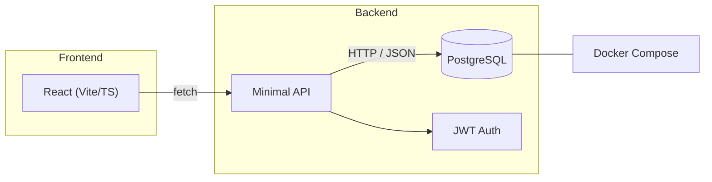
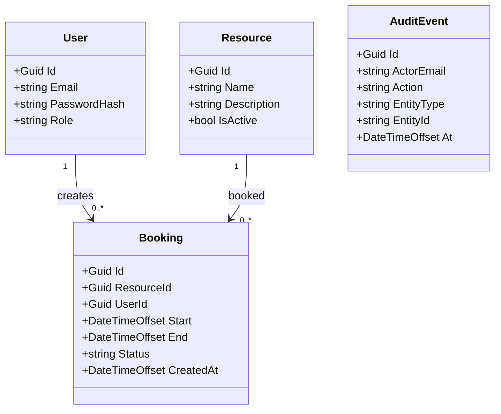
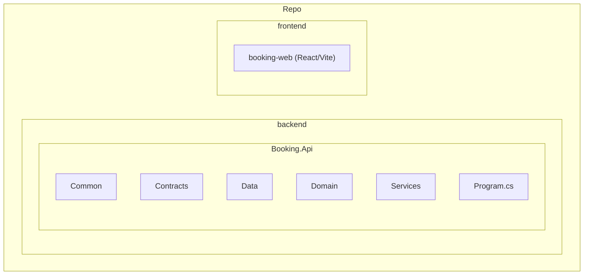
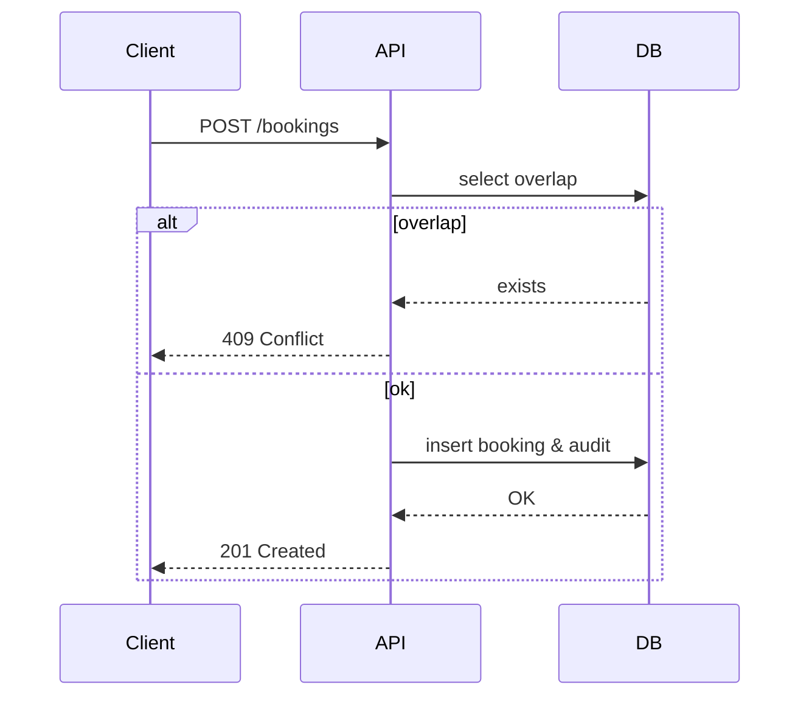

# Booking Platform

> **Full‑stack booking demo** built to illustrate clean architecture,
> realistic domain logic, and secure APIs.  Ideal for portfolio and
> learning purposes.


---

## Table of Contents

1. [Overview](#overview)
2. [Features](#features)
3. [Architecture](#architecture)
   - [Component Diagram](#component-diagram)
   - [Data Model](#data-model)
   - [Directory Layout](#directory-layout)
4. [Getting Started](#getting-started)
   - [Prerequisites](#prerequisites)
   - [Running Locally](#running-locally)
   - [Environment Variables](#environment-variables)
5. [API Reference](#api-reference)
   - [Authentication](#authentication)
   - [Resources](#resources)
   - [Bookings](#bookings)
   - [Development & Seed Data](#development--seed-data)
6. [Testing](#testing)
7. [Deployment](#deployment)
8. [Roadmap](#roadmap)
9. [Philosophy & Contributing](#philosophy--contributing)

---

## Overview

A micro‑service‑like backend written with **.NET 8 minimal APIs** and
**Entity Framework Core**, paired with a lightweight **React + Vite**
frontend.  The goal is to provide a realistic, extensible platform for
learning backend design patterns, domain validation, and full‑stack
integration.

### Component Diagram



### Data Model



### Directory Layout



---

## Features

- JWT authentication with BCrypt‑hashed passwords
- Role‑aware (Admin/User) skeleton for authorization
- Overlap rule prevents double bookings (see `BookingRules`)
- Audit logging of create/update/delete actions
- Minimal API endpoints with thin wiring and service layer
- React frontend consuming JSON endpoints
- Dockerized PostgreSQL for easy local setup
- Clean architecture: contracts, domain, services, data
- Unit tests and GitHub Actions CI configuration

---

## Getting Started

### Prerequisites

- [.NET 8 SDK](https://dotnet.microsoft.com/download)
- Node 16+ / npm
- Docker (PostgreSQL container)
- Optional: VS Code or your preferred editor

### Running Locally

1. **Start the database**
   ```bash
   docker compose up -d
   ```
2. **Start the backend**
   ```bash
   cd backend/Booking.Api
   dotnet restore
   dotnet run
   ```
   - API: `http://localhost:5252`
   - Swagger UI: `http://localhost:5252/swagger`
3. **Start the frontend**
   ```bash
   cd frontend/booking-web
   npm install
   npm run dev
   ```
   - UI: `http://localhost:5173`

### Environment Variables

Default configuration lives in `backend/Booking.Api/appsettings.json`.
You can override values using environment variables (double underscore
notation):

```bash
export Jwt__Key="supersecretchangeme1234567890"
export ConnectionStrings__db="Host=localhost;Port=5433;Database=booking;Username=booking;Password=booking"
```

> **Tip:** JWT key must be at least 32 characters (HS256 requirement).

### Development & Seed Data

To populate the database with demo users/resources, call:

```http
POST /dev/seed
```

**Credentials**

- Admin — `admin@demo.no` / `admin`
- User — `user@demo.no` / `user`

---

## API Reference

### Authentication

`POST /auth/login`

**Request**
```json
{ "email": "...", "password": "..." }
```

**Response**
```json
{ "token": "...", "role": "User", "email": "user@demo.no" }
```

### Resources

`GET /resources` — returns all active resources. Requires
`Authorization: Bearer <token>`.

### Bookings

`POST /bookings`

```json
{
  "resourceId": "GUID",
  "start": "2026-02-18T10:00:00Z",
  "end": "2026-02-18T11:00:00Z"
}
```

- `201 Created` with booking object on success
- `409 Conflict` if time overlaps an existing booking

#### Create booking sequence



### Health & Misc

- `GET /health` – simple liveness check returning `{ status: "ok" }`

---

## Testing

Backend tests are under `tests/Booking.Api.Tests`.

```bash
cd tests/Booking.Api.Tests
dotnet test
```

---

## Deployment

- Build Docker images for backend/front end (not included here)
- CI pipeline (GitHub Actions) already validates build & tests.
- Add deployment step to container registry/hosting of choice.

---

## Roadmap

1. Role‑based authorization rules (Admin vs User)
2. "My bookings" and cancellation endpoints
3. Admin resource management & dashboard
4. Full CI/CD with container publishing
5. Enhanced UX, detailed error handling, audit review UI

---

## Philosophy & Contributing

This repository is a learning playground.  Keep PRs small, well‑tested,
and focused on a single concern.  Follow clean‑code and SOLID
principles; prefer clarity over cleverness.

> Passwords are hashed only for demonstration; **do not** use this
> code in production without review.
